<div align="center">
        
    <br/>
    <br/>
    <a href="https://git.io/typing-svg"></a>
</div>

<div align="center">
    <a href="https://t.me/mahiro_ext"></a>
    <a href="https://vt.tiktok.com/ZSXHnFJ5X/"></a>
    <a href="https://github.com/Cartethyiaaa"></a>
</div>

## 👻 A little about me...
[](https://github.com/Jurredr/github-widgetbox)

I am an **Android ROM & Kernel Developer** focused on system-level modding for **MediaTek-based** devices. My day-to-day work covers building custom GKI kernels, ROM porting, smali-level framework patching, and debugging SELinux policies and vendor HALs.

Besides Android, I also occasionally dive into **web design** — building dashboards, project support tools, and small web GUIs to streamline my development workflow.

Right now I'm actively building a **custom GKI kernel (android16-6.12)** with **KernelSU-Next** and **SUSFS** using a Bazel/Kleaf build system, alongside ongoing work on OTA, SELinux, and thermal management issues for the devices I work with.

---

### 🛠️ What I usually work on

- **Kernel Development** — GKI kernel builds (android12-5.10 to android16-6.12), Bazel/Kleaf, defconfig tuning, KernelSU/SUSFS integration, AnyKernel3 packaging
- **ROM Porting & Building** — smali-level framework patching (SystemUI, FOD/UDFPS, Settings addon), build.prop optimization, bootloop diagnosis
- **SELinux Policy** — AVC denial diagnosis, CIL rule authoring, precompiled_sepolicy troubleshooting
- **System Daemons & Tools** — Rust daemons for thermal management, vibrator HAL, automation scripts (ZRAM, lmkd, TCP congestion tuning)
- **Web Design** — dashboards & support tools (e.g. GUI for flashing tools, web-based firmware finder)
- **CI/CD** — GitHub Actions for kernel matrix builds & automation pipelines

---

### 📦 Device focus
`Infinix X6886 (MT6789/MT6899)`

---

### 🌐 Social Media

[](https://t.me/mahiro_ext)
[](https://vt.tiktok.com/ZSXHnFJ5X/)

### 👥 Community

[](https://t.me/hiralayalos)

---

### 💻 Tech Stack


```javascript
const Mahirooo = {
    OS: ["Android (rooted)", "Arch Linux + Hyprland"],
    languages: {
        highLevel: ["Kotlin", "Java", "Python"],
        averageLevel: ["Rust", "JavaScript"],
        baseLevel: ["C", "Bash", "Smali"]
    },
    androidDev: {
        kernel: ["Bazel/Kleaf", "GKI", "KernelSU-Next", "SUSFS", "AnyKernel3"],
        rom: ["Smali patching", "SELinux/CIL", "AOSP tooling", "Build.prop tuning"],
        automation: ["GitHub Actions", "Termux", "Shell scripting"]
    },
    web: {
        frontend: ["HTML", "CSS", "JavaScript"],
        tools: ["Flask", "Web GUI for flashing tools"]
    },
    devOps: ["Docker", "Git", "CI/CD pipelines"]
};
```

---

> [!CAUTION]
> My projects are also shared in my Telegram Group.

Daily driver setup: **Termux** on a rooted Android device + **Hyprland** on a Linux desktop, plus **GitHub Actions** for CI/CD.

## ☕ Support Me
If you'd like to support me or any of my projects, you can do so here:

| Platform | Link |
| -------- | ---- |
| **Sociabuzz** | https://sociabuzz.com/hirateam |

---

### 📊 GitHub Stats

<div align="center">
    
</div>

### 🕹️ Contribution Graph

<div align="center">
    
</div>
